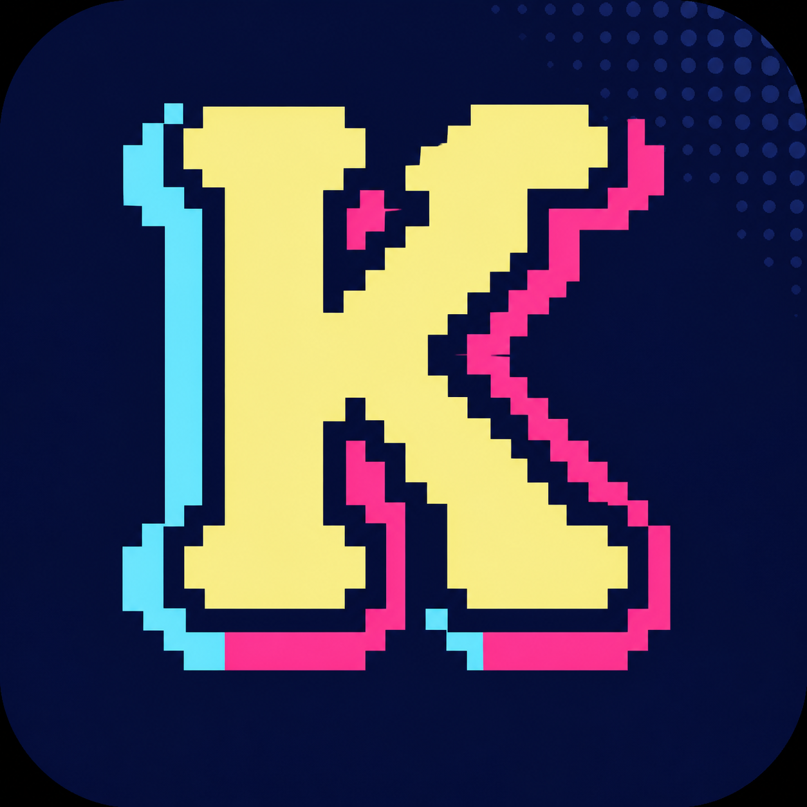
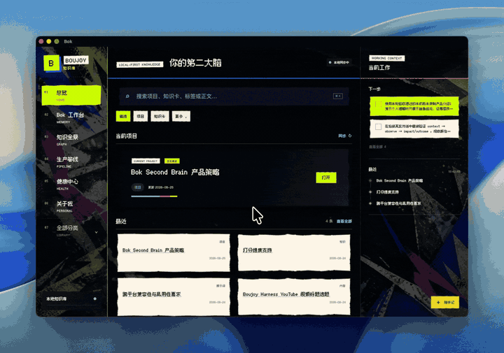

# Bok

> A local memory system that helps different AI agents keep understanding you.

<p align="center">
  
</p>

<p align="center">
  <strong>Local-first · Markdown source of truth · Cross-agent · Traceable · Reversible · Forgettable</strong>
</p>

<p align="center">
  <a href="https://github.com/asen-goat-mine/bok/releases"></a>
  <a href="https://github.com/asen-goat-mine/bok/actions/workflows/ci.yml"></a>
  <a href="LICENSE"></a>
  
  
</p>

<p align="center"><a href="#english">English</a> · <a href="#中文">中文</a></p>



<a id="english"></a>

## What is Bok?

Bok gives Codex, Claude Code, ChatGPT, DeepSeek, and other agents a shared local long-term memory layer.

During conversations and project work, it captures durable signals and compresses them into reusable knowledge, project state, working methods, and an evolving understanding of the user. When you switch chats, agents, or return to a project, Bok retrieves only the few cited passages that matter to the current task.

It is not a chat-log warehouse, and it does not require daily manual organization.

## What can it do?

- **Resume a project:** recover current progress, prior decisions, and the next action.
- **Help agents understand you:** learn working habits, communication preferences, project experience, and decision patterns from long-term interactions, corrections, and outcomes.
- **Work across agents:** expose the same local memory through MCP or an authenticated loopback Memory API.
- **Create knowledge and skills:** turn papers, source material, plans, and high-value conversations into Markdown knowledge cards or reusable skills.
- **Capture quick notes:** record an idea from a separate lightweight window without choosing a title, category, or tag first.
- **Use existing Markdown:** open an existing Markdown folder or Obsidian vault without locking data into a database or platform.
- **Stay inspectable:** browse and edit knowledge, projects, personal memory, provenance, versions, and cleanup candidates in the UI.

## How it works

```text
Conversations / local files / quick notes
                    │
                    ▼
       Local receipts, value filtering,
           and abstract understanding
                    │
          ┌─────────┴─────────┐
          ▼                   ▼
    Markdown Vault       Personal Core
  knowledge and projects  understanding of you
          └─────────┬─────────┘
                    ▼
 keyword + structure + optional semantic retrieval
                    │
                    ▼
      minimal cited context for the current agent
```

Bok separates data into three layers:

1. **Vault:** projects, knowledge cards, content, prompts, and skills stored as ordinary Markdown.
2. **Personal Core:** traceable user understanding stored outside project and Git repositories.
3. **`.bok` runtime state:** indexes, caches, receipts, versions, and backups. It is runtime state, not the source of truth.

## Personal memory is not a copy of what you said

Bok should understand the user rather than save raw quotes as permanent labels.

- No personal observation is created without a valid third-person abstract interpretation.
- A single action remains evidence; it does not immediately become a global preference.
- Explicit, low-risk, high-confidence patterns—or patterns repeated across sessions—can quietly become active.
- Identity, long-term goals, authorization rules, sensitive data, conflicts, and low-confidence claims still require intervention.
- Every claim keeps provenance, versions, impacts, and outcomes.
- A full forget operation removes the claim, observations, impacts, outcomes, old versions, and related private backups.

## Quick start

### Desktop app

macOS users can download the DMG from [Releases](https://github.com/asen-goat-mine/bok/releases), move Bok to Applications, and open it.

On first launch, Bok creates:

- a clean Starter Vault;
- a separate, initially empty Personal Core;
- local indexes, versions, and runtime configuration.

Upgrades replace the app only. They do not overwrite the user's vault, Personal Core, quick notes, backups, or settings.

Windows source build support is included. The first public Windows installer still requires final build and signing validation on real Windows hardware.

### Python core

The Bok core uses only the Python standard library. Python 3.9 or newer is recommended.

```bash
git clone https://github.com/asen-goat-mine/bok.git
cd bok
./Bok/start-bok.command
```

Windows:

```powershell
git clone https://github.com/asen-goat-mine/bok.git
cd bok
Bok\start-bok.cmd
```

The service binds to loopback only and defaults to `127.0.0.1:8771`.

## Connect Codex and other agents

The desktop app provides a one-click connection flow under **Bok Workspace → Settings**.

To register Bok as a Codex MCP server manually:

```bash
cd /path/to/your/markdown-vault

codex mcp add bok \
  --env PYTHONPATH="/path/to/bok/Bok" \
  -- python3 -m bok_core --vault "$PWD" mcp
```

After opening a new Codex task, the agent can use:

- `bok_search` for local knowledge retrieval;
- `bok_context` for minimal cited task context;
- `bok_project_resume` for project state;
- `bok_observe_conversation` for idempotent local conversation receipts;
- `bok_person_context` for task-relevant user understanding;
- `bok_quick_note` for quick capture.

Local clients without MCP support can use the authenticated loopback Memory API. See the [API documentation](Bok/docs/API-v1.md).

## Retrieval

Bok combines keywords, titles, tags, paths, document structure, metadata, and source weighting.

Embeddings are an optional recall enhancer:

- Markdown remains the only knowledge source of truth.
- Vectors live in a deletable, rebuildable cache.
- Bok works without embeddings.
- You can use a local embedding provider, or explicitly disable Local Only and authorize a compatible provider.

This preserves exact path and project-state retrieval while improving paraphrase recall, instead of forcing every query through pure vector search.

## Local and privacy boundaries

- `local_only: true` by default.
- The API may bind to loopback addresses only.
- The browser UI never receives administrator tokens or plaintext agent credentials.
- External material, temporary sessions, and do-not-remember content are isolated at ingestion.
- Conversation bodies are retained for 14 days by default; body-free processing receipts can remain afterward.
- Personal Core must stay outside the project vault and Git repository.
- Share builds use a file allowlist and are scanned for local paths, secrets, tokens, private vaults, and runtime caches.
- Cloud models are never enabled silently; Local Only rejects non-loopback requests at the network boundary.

See [Security and tests](Bok/docs/SECURITY-AND-TESTS.md) for the full contract.

## Source layout

```text
Bok/
├── Bok/                    Python memory core, CLI, MCP, and Memory API
├── AI-Second-Brain-UI/     Knowledge, personal memory, graph, and quick-note UI
├── Bok-Desktop/            Tauri shell, Starter Vault, and platform builds
└── docs/assets/            README media
```

Key modules:

- `storage.py`: atomic writes, versions, trash, backup, and recovery;
- `search.py`: chunking, hybrid retrieval, citations, and token budgets;
- `memory.py` / `conversation.py`: quiet capture, idempotent receipts, and retention;
- `person.py` / `person_learning.py`: claims, evidence, authorization, outcomes, and forgetting;
- `mcp.py` / `api.py`: cross-agent integration;
- `service.py`: unified product capability layer.

## Build the desktop app

macOS:

```bash
cd Bok-Desktop
./build-macos.command
```

Windows PowerShell:

```powershell
cd Bok-Desktop
.\build-windows.ps1
```

Public distribution still requires Developer ID signing and notarization on macOS, and a code-signing certificate on Windows. Unsigned builds retain local functionality but may trigger operating-system warnings.

## Tests

Python core:

```bash
cd Bok
python3 -m unittest discover -s tests -p 'test_*.py' -v
```

UI product contracts:

```bash
python3 AI-Second-Brain-UI/tests/test_product_contracts.py
```

Desktop allowlist and privacy contracts:

```bash
python3 Bok-Desktop/scripts/prepare_share.py --workspace .
python3 Bok-Desktop/scripts/test_desktop_contracts.py
python3 Bok-Desktop/scripts/privacy_audit.py .
```

The current release includes:

- 117 Python core contracts;
- 31 UI product contracts;
- 8 desktop resource, privacy, and native-bridge contracts;
- real-browser smoke tests at desktop and mobile sizes;
- retrieval regressions built from realistic questions.

## Current scope

Bok 0.6.0 is the first public release. It does not currently aim to replace:

- the full Obsidian plugin ecosystem;
- team knowledge bases and multi-user permissions;
- a cloud synchronization service;
- native mobile apps;
- a heavyweight vector database.

The priority is local data that stays readable, portable, traceable, and deletable.

## Contributing

Issues and pull requests are welcome. Changes to memory, authorization, forgetting, recovery, or privacy boundaries must include matching contract tests.

## License

Bok is licensed under the [Apache License 2.0](LICENSE). You may use, modify, and distribute it, including for commercial purposes, subject to the license and notice requirements.

---

<a id="中文"></a>

# Bok 中文说明

> 让不同 Agent 持续理解你的本地记忆系统。

**本地优先 · Markdown 事实源 · 跨 Agent · 可追溯 · 可撤销 · 可彻底遗忘**

## Bok 是什么

Bok 给 Codex、Claude Code、ChatGPT、DeepSeek 和其他 Agent 提供一层共享的本地长期记忆。

它在对话和协作过程中捕获有长期价值的信息，把原始材料压缩成可复用的知识、项目状态、工作方法与个人理解；下次换窗口、换 Agent 或继续项目时，只取当前任务真正需要的几段引用上下文。

它不是聊天记录仓库，也不要求你每天手动整理。

## 你能用它做什么

- **继续上次的项目**：找回当前进度、已经做过的决定和下一步。
- **让 Agent 更懂你**：从长期对话、纠正和结果中形成对工作习惯、表达偏好、项目经历和选择方式的理解。
- **跨 Agent 复用**：通过 MCP 或认证的本机 Memory API，让不同 Agent 使用同一份本地记忆。
- **沉淀知识与 Skill**：把论文、资料、方案和高价值对话整理成 Markdown 知识卡或可复用 Skill。
- **随手记**：从独立小窗口快速记录想法，不必先起标题、分类或标签。
- **兼容已有 Markdown**：直接使用现有 Markdown 文件夹或 Obsidian Vault，不锁定数据库和平台。
- **看得见也改得掉**：知识、项目、个人记忆、来源、版本和清理候选都可视化。

## 它怎么工作

```text
你和 Agent 的对话 / 本地资料 / 随手记
                  │
                  ▼
        本地收据、价值判断与抽象理解
                  │
        ┌─────────┴─────────┐
        ▼                   ▼
  Markdown Vault       Personal Core
  知识与项目事实源      对你的长期理解
        └─────────┬─────────┘
                  ▼
      关键词 + 结构 + 可选语义混合检索
                  │
                  ▼
     只向当前 Agent 返回最小引用上下文
```

Bok 把数据分成三层：

1. **Vault**：项目、知识卡、内容、提示词和 Skill，保持普通 Markdown。
2. **Personal Core**：独立于项目和 Git 仓库，保存对你的可追溯理解。
3. **`.bok` 运行状态**：索引、缓存、收据、版本和备份；不会成为知识事实源。

## 个人记忆不是“复制你的原话”

Bok 的目标是形成对用户的理解，而不是把原话保存成永久标签。

- 没有合格的第三人称抽象理解，不生成个人观察。
- 单次行为只作为证据，不直接升级成全局偏好。
- 明确、低风险、高置信，或跨会话重复出现的模式可以安静生效。
- 身份、长期目标、授权规则、敏感内容、冲突和低置信判断仍需要介入。
- 每条理解都保留来源、版本、影响和结果记录。
- “彻底忘记”会清理 Claim、观察、影响、结果、旧版本及相关私人备份。

## 快速开始

### 直接使用桌面版

macOS 用户可以在 [Releases](https://github.com/asen-goat-mine/bok/releases) 下载 DMG，拖入“应用程序”后打开。

第一次启动会自动创建：

- 一份干净的 Starter Vault；
- 一份独立且初始为空的 Personal Core；
- 本机索引、版本与运行配置。

后续升级只替换程序，不覆盖用户的 Vault、Personal Core、随手记、备份和设置。

Windows 的源码构建入口已经提供；第一版公开安装包仍需要在真实 Windows 环境完成最终构建与签名验收。

### 运行 Python 核心

Bok 核心只依赖 Python 标准库，建议使用 Python 3.9 或更高版本。

```bash
git clone https://github.com/asen-goat-mine/bok.git
cd bok
./Bok/start-bok.command
```

Windows：

```powershell
git clone https://github.com/asen-goat-mine/bok.git
cd bok
Bok\start-bok.cmd
```

服务只监听本机 loopback 地址，默认是 `127.0.0.1:8771`。

## 连接 Codex 和其他 Agent

桌面版可以在“Bok 工作台 → 设置”中使用一键连接。

手动注册 Codex MCP：

```bash
cd /path/to/your/markdown-vault

codex mcp add bok \
  --env PYTHONPATH="/path/to/bok/Bok" \
  -- python3 -m bok_core --vault "$PWD" mcp
```

重新打开 Codex 任务后，Agent 可以按需使用：

- `bok_search`：检索本地知识；
- `bok_context`：为当前任务生成最小引用上下文；
- `bok_project_resume`：恢复项目状态；
- `bok_observe_conversation`：留下幂等的本地对话收据；
- `bok_person_context`：获取与当前任务有关的个人理解；
- `bok_quick_note`：写入随手记。

不支持 MCP 的本机客户端可以使用认证的 loopback Memory API，详见 [API 文档](Bok/docs/API-v1.md)。

## 检索

Bok 默认使用关键词、标题、标签、路径、文档结构、元数据和来源权重进行混合排序。

Embedding 是可选的召回增强：

- Markdown 仍然是唯一知识事实源；
- 向量只保存在可删除、可重建的缓存中；
- 不启用 Embedding 也能正常使用；
- 可以使用本地 Embedding，或在明确关闭 Local Only 并授权后接入兼容 Provider。

这样既保留精确路径和项目状态检索，也能改善近义表达召回，而不是把所有查询都塞给纯向量搜索。

## 本地与隐私边界

- 默认 `local_only: true`。
- API 只允许绑定 loopback 地址。
- 浏览器前端拿不到管理员 token 或 Agent 明文凭证。
- 外部材料、临时会话与“不记忆”内容在入口隔离。
- 对话正文默认保留 14 天，到期后只保留不含正文的处理收据。
- Personal Core 必须位于项目 Vault 和 Git 仓库之外。
- 分享构建采用文件白名单，并在发布前扫描本机路径、密钥、token、私人 Vault 与运行缓存。
- 云端模型不会被静默启用；Local Only 模式下非 loopback 请求会在网络层被拒绝。

完整边界见 [安全与测试](Bok/docs/SECURITY-AND-TESTS.md)。

## 源码结构

```text
Bok/
├── Bok/                    Python 记忆内核、CLI、MCP 与 Memory API
├── AI-Second-Brain-UI/     知识、个人记忆、图谱与随手记 UI
├── Bok-Desktop/            Tauri 桌面壳、Starter Vault 与双平台构建
└── docs/assets/            README 演示素材
```

核心模块：

- `storage.py`：原子写入、版本、回收站、备份和恢复；
- `search.py`：段落切分、混合检索、引用和 Token 预算；
- `memory.py` / `conversation.py`：安静捕获、幂等收据和保留期；
- `person.py` / `person_learning.py`：Personal Claim、证据、授权、结果和遗忘；
- `mcp.py` / `api.py`：跨 Agent 接入；
- `service.py`：统一产品能力入口。

## 构建桌面版

macOS：

```bash
cd Bok-Desktop
./build-macos.command
```

Windows PowerShell：

```powershell
cd Bok-Desktop
.\build-windows.ps1
```

公开分发前，macOS 仍需要 Developer ID 与公证，Windows 仍需要代码签名证书；未签名不影响本地功能，但操作系统可能显示来源警告。

## 测试

Python 核心：

```bash
cd Bok
python3 -m unittest discover -s tests -p 'test_*.py' -v
```

UI 产品合同：

```bash
python3 AI-Second-Brain-UI/tests/test_product_contracts.py
```

桌面白名单与隐私合同：

```bash
python3 Bok-Desktop/scripts/prepare_share.py --workspace .
python3 Bok-Desktop/scripts/test_desktop_contracts.py
python3 Bok-Desktop/scripts/privacy_audit.py .
```

当前版本包含：

- 117 项 Python 核心合同；
- 31 项 UI 产品合同；
- 8 项桌面资源、隐私与原生桥接合同；
- 桌面和移动尺寸的真实浏览器冒烟验收；
- 使用真实问法构建的检索回归集。

## 当前边界

Bok 0.6.0 是第一版公开版本。它当前不打算替代：

- 完整 Obsidian 插件生态；
- 团队知识库与多人权限系统；
- 云端同步服务；
- 原生移动端；
- 重型向量数据库。

项目优先保证本地数据可读、可迁移、可追溯和可删除。

## 参与开发

欢迎提交 Issue 和 Pull Request。修改记忆、权限、遗忘、恢复或隐私边界时，请同时补充对应合同测试。

## 许可证

本项目采用 [Apache License 2.0](LICENSE)。你可以使用、修改和分发代码，包括商业用途；请遵守许可证并保留必要声明。
